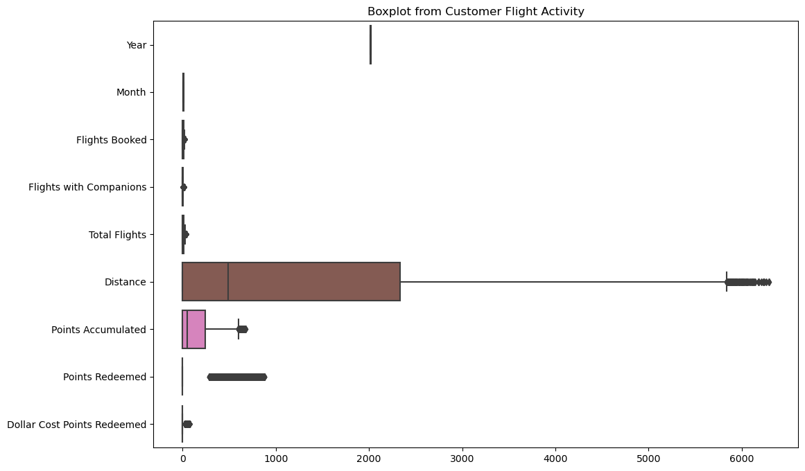
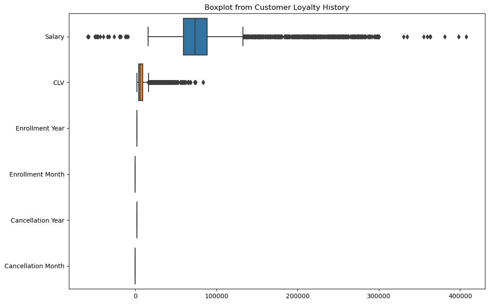
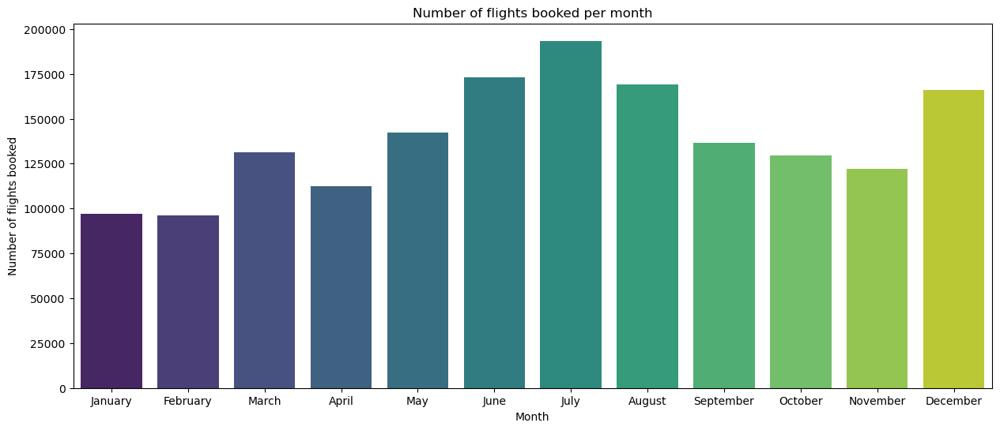
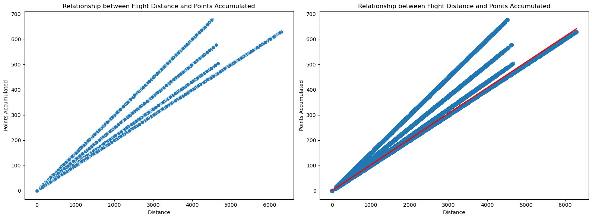
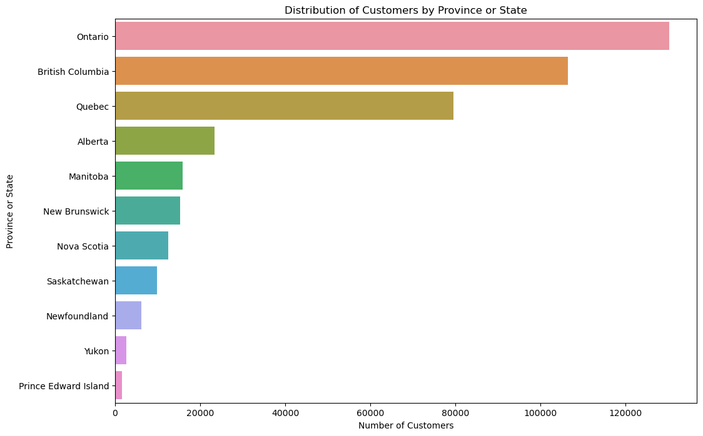
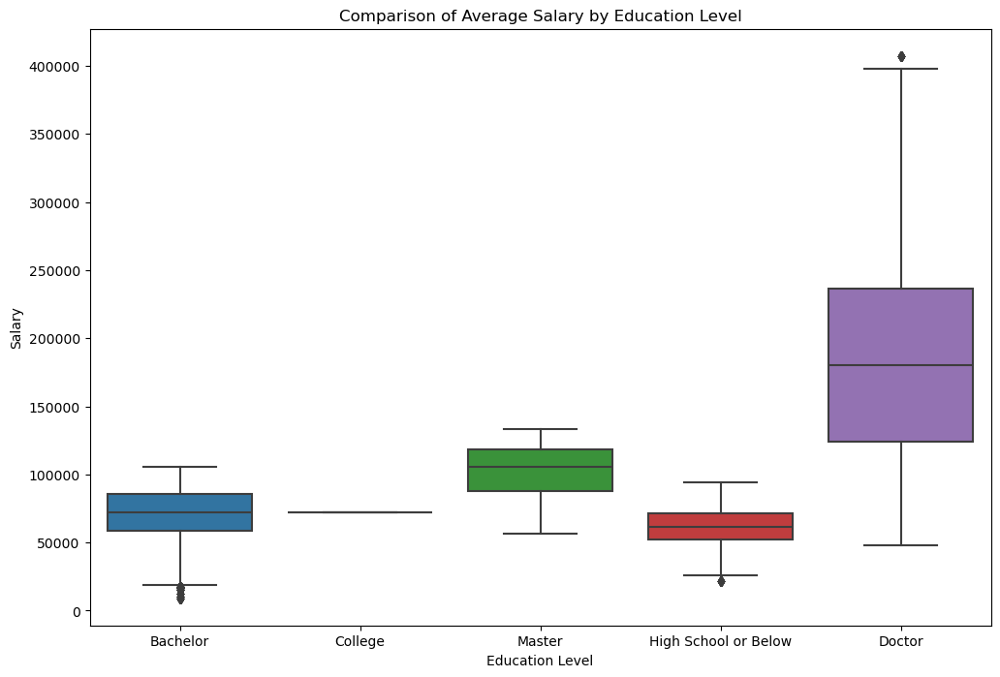
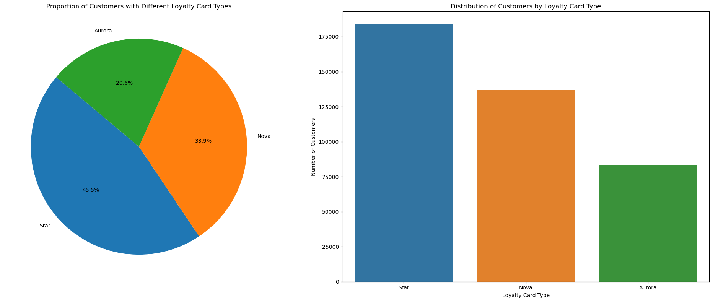
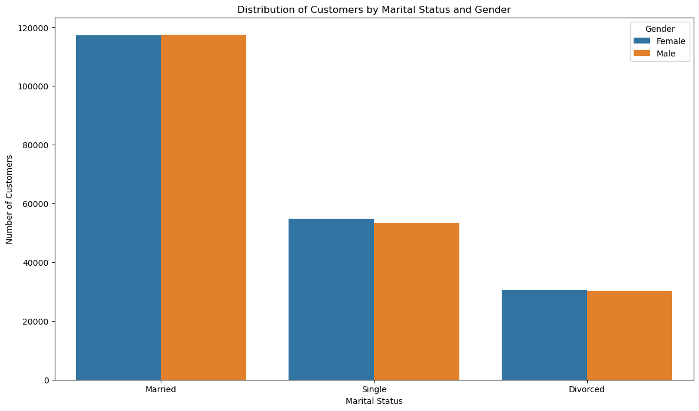

### Final Evaluation Module 3
# ✈ Flight Booking Data Analysis ✈

## 📝 Project statement
Hello! My name is Bea and this is my final evaluation exam for module 3 of the Adalab Data Analytics course.

This project focuses on the analysis of a flight booking dataset with the objective of exploring, cleaning, visualizing and evaluating significant differences in the number of flights booked according to the educational level of the customers.

## 🚧 Project structure

- data
  - customer_flight_activity.csv
  - customer_loyalty_history.csv
- jpg
    - barplot_flights_month.png
    - boxplot_distance_points.png
    - boxplot_education_salary.png
    - boxplot_flight.png
    - boxplot_flight_counts.png
    - boxplot_loyalty.png
    - boxplot_salary.png
    - countplot_customers_state.png
    - countplot_marital_status.png
    - graphics_customers_cardtype.png
    - graphics_distance_points.png

- jupyter
    - 1_initial_exploration.ipynb
    - 2_data_cleaning.ipynb
    - 3_visualization.ipynb
    - 4_ab_testing.ipynb

### ⚠ Note
Throughout the jupyter you will see that I use two more csvs, `clean_customer_data.csv` and `merged_customer_data.csv`. Both are pulled as the jupyter runs but are not included in the corresponding project folder because they are too heavy and git won't allow me to upload them properly.

## ⚙ Requirements

- Python 
- Jupyter Notebook
- Visual Studio Code

## 🛠 Installation


1. Install **Python**:
   - Download and install Python from [Python.org](https://www.python.org/downloads/).
   - Make sure to check the option to add Python to your PATH during the installation.

2. Install **Jupyter Notebook**:
   - Open a terminal or command prompt and run the following command to install Jupyter Notebook:
     ```bash
     pip install notebook
     ```
3. Install **Visual Studio Code**:
   - Download and install Visual Studio Code from [Visual Studio Code](https://code.visualstudio.com/).

4. Install Visual Studio Code Extensions:
   - Open Visual Studio Code.
   - Go to the Extensions view by clicking on the square icon in the sidebar or pressing `Ctrl+Shift+X`.
   - Search for and install the following extensions:
     - Python (by Microsoft)
     - Jupyter (by Microsoft)


    
## 📋 Phases

### Phase 1: Exploration and Cleaning
#### EDA
Please run the `1_initial_exploration.ipynb` file to see the results of my analysis. These were the steps to follow:
- Identification of problems such as nulls, outliers and missing data.
- Use of Pandas to obtain information about data structure and basic statistics.
- Joining of data sets.
#### EDA Graphics


#### EDA Conclusions

Customer Flight Activity Observations:

- No null values.
- There are no categorical columns.
- 9 int columns
- 1 float column

Customer Loyalty History Remarks:

- 9 columns object
- 4 float columns
- 2 int columns
- Numeric: `Salary`, `CLV`, `Enrollment Year`, `Enrollment Month`, `Cancellation Year` and `Cancellation Month`.
- `Salary` has null values and a negative values.
- `Cancellation` Year and Cancellation Month have many null values.
- `Country` has only one value ("Canada").

Null

- `Salary` has 4238 nulls
- `Cancellation Year` has 14670 nulls
- `Cancellation Month` has 14670 nulls

Outliers

- `Salary` has negative
- There are at least 6 columns with high outliers that influence the mean. Continue to explore.

Data Consistency

- There are no typos or oddities in the categorical values.
- Columns are well named, but could be lowercase and with a low slash in the spaces to facilitate future processing.

Data cleaning

- Edit negative value of `Salary`
- Impute or remove nulls from `Salary`
- We will not remove the year and month of cancellation columns as it may mean that they are still subscribed.
- Some duplicates are of passengers even if they do not travel, we will remove them.
- Remove the `Country` column since it has only a single value and is not relevant in the analysis.
- I do not see that we need the `Enrollment Year`, `Enrollment Month`, `Cancellation Year` and `Cancellation Month` columns later on to change their type so I leave them as they are.

Other remarks 

These are data for national flights in Canada.

#### Data Cleanup
Please run the `2_data_cleaning.ipynb` file to see the results of my cleaning. These were the steps to follow:

- Removal or treatment of null values in key columns.
- Verification of data consistency and correctness.
- Adjustments and conversions needed in the columns.

### Phase 2: Visualization
- Distribution of the number of flights booked per month.

We can observe that July is the month with the highest number of flights, followed by June, August and December, corresponding to the usual holiday periods.

- Relationship between the distance of the flights and the points accumulated by the clients.

The relationship between the number of points accumulated and the distances traveled by travelers is evident.

- Distribution of customers by province or state.

The people of Ontario travel the most compared to those of Prince Edward Island.

- Comparison of average salary between different educational levels.

We can see clear outliers affecting median wages, with higher levels of education peaking at the top and lower levels of education at the bottom.

- Proportion of customers with different types of loyalty cards.

There is a higher proportion of customers with the "Star" loyalty card, although it is below 50% of the total number of cards of active customers.

- Distribution of customers by marital status and gender.

Although there is hardly any difference between the number of men and women who travel, it is clear that married people travel more.

### Phase 3: Evaluation of Differences in Flight Bookings by Education Level
Please open the file `4_ab_testing.ipynb` and run it.
#### Data Preparation
- Filtering of the data set to include only the 'Flights Booked' and 'Education' columns.
- Although there is hardly any difference between the number of men and women who travel, it is clear that married people travel more.

#### Descriptive Analysis
- Grouping of data by education level and calculation of basic descriptive statistics.

#### Statistical Test
- Performed A/B testing to determine significant differences.

#### Interpretation of results

- The median flights_booked is significantly different between the "University" and "Non-University" groups.
- This suggests that the number of flights booked tends to be different between these two educational groups.

If the median number of flights booked by college students is higher, this could imply that college-educated people tend to travel more.

## ℹ Usage
To run the analyses and visualizations, open the Jupyter Notebook files in Visual Studio Code in order and run everything after selecting your kernel.


## ✒ About me
Hi! I'm Bea, an illustrator currently training to be a data analyst. You can find more of my class work in my profile, which I hope to fill with new personal projects in the future.

- [Bea](https://github.com/BeaDataArtist)

Thank you for reading us and we hope you find our project useful!


## 🎁 Acknowledgements
To the ADALAB professors for the attention given throughout the project.
To our classmates for their support and for sharing.

